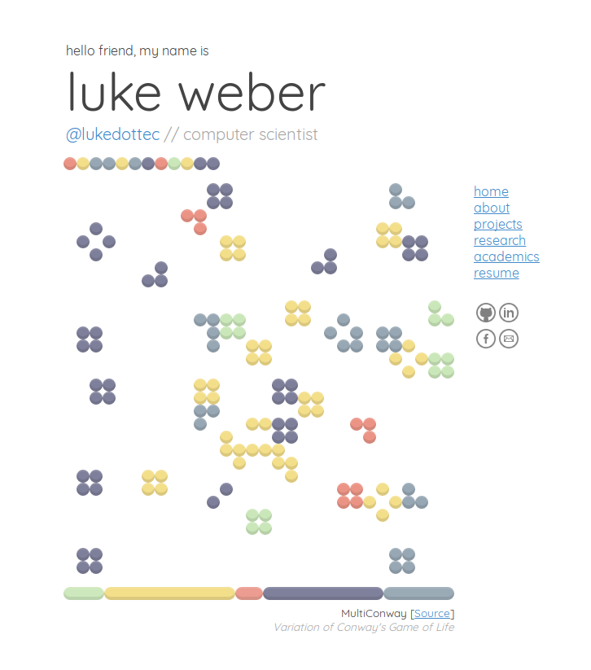

# Personal Website

### Summary
My personal website designed around a live simulation of Conway's Game of Life, which I've adapted to now include many "types" of cells, distinguished only by color, in addition to other alterations of the reproduction/extermination conditions—hopefully it makes things more interesting. Also, we have what I have dubbed a "morgue," which is a queue of all of the cells that have died in the process of the simulation; you can seen them given homage by using them throughout the page as design elements!

_Made it from scratch (with the help of Conway and some jQuery)!_
